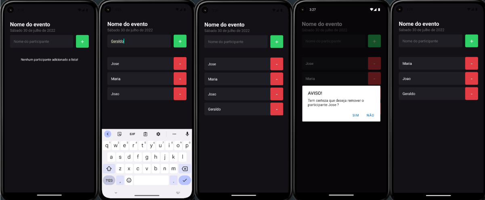

## Listar participantes de um evento

---

### Screens

---



---
## Começando

### Pré-requisítos

Para executar este projeto no modo de desenvolvimento, você precisará ter um ambiente básico para executar um React-Native App.
Neste link vocẽ encontrará todas as informações (https://facebook.github.io/react-native/docs/getting-started)

---
### Instalação

**Clonando o Repositório**

```
$ git clone git@github.com:wbsartori/app-inhere-react-native.git

$ cd app-inhere-react-native
```

---
**Instalando dependências**

```
$ npm
```

_ou_

```
$ npm install
```

---
**Expo/Android Studio**

Você pode utilizar o projeto utilizando o emulador do Android Studio ou o Expo, no meu caso foi utilizado o expo.

Neste link vocẽ encontrará todas as informações de instalação (https://docs.expo.dev/get-started/installation)

---

Após instalar execute o comando abaixo dentro da raiz do projeto:

```
$ expo start
```
---
## Contribuindo


E-mail: wbsartori@gmail.com

Conecte-se comigo em [LinkedIn](https://www.linkedin.com/in/wesleysartori/)

Obrigado !

---
## Licença

Este projeto está licenciado sob a Licença MIT - veja o [LICENSE.md](https://github.com/wbsartori/app-inhere-react-native/blob/master/LICENSE) arquivo para detalhes
